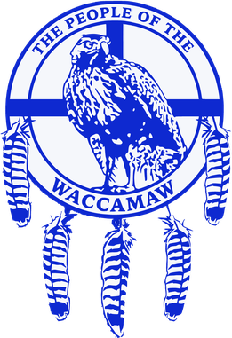

# Waccamaw.org

Official website of the Waccamaw Indian People - South Carolina's first state-recognized tribe.



## Overview

The Waccamaw Indian People are a state-recognized tribe in South Carolina, making history as the first tribe to gain official recognition in 2005. Our community is based in the Dog Bluff area near Aynor, SC, where we preserve our heritage and culture.

This repository contains the **Micro.blog Hugo theme component** of our multi-platform website architecture. The complete waccamaw.org site uses a segmented approach with Cloudflare Workers for intelligent routing.

## Architecture

Our website uses a **segmented multi-platform architecture** with Cloudflare Workers for routing:

- **`/updates`** → Micro.blog (this repository) - News, updates, and blog content
- **`/home`** → Framer - Marketing site and tribal information
- **`/members`** → Future microservice - Member portal (planned)

See [ARCHITECTURE.md](./ARCHITECTURE.md) for detailed infrastructure documentation.

## Technology Stack

- **Static Site Generator**: Hugo
- **Platform**: Micro.blog
- **Templating**: Go HTML templates
- **Routing**: Cloudflare Workers
- **DNS**: Cloudflare DNS
- **Configuration**: JSON (config.json)

## Quick Start

### Prerequisites

- Hugo installed
- Git configured
- GitHub account with Copilot access (for contributors)

### Local Development

1. **Clone the repository**
   ```bash
   git clone https://github.com/waccamaw/dotorg.git
   cd dotorg
   ```

2. **Set up environment**
   ```bash
   cp .env.example .env
   # Edit .env with your git credentials
   ```

3. **Configure Git** (using Just)
   ```bash
   just git-setup
   ```

4. **Start Hugo server**
   ```bash
   just serve
   # Or manually: hugo server --watch --bind="0.0.0.0" --port="1313"
   ```

5. **View the site**
   Open http://localhost:1313/ in your browser

## Contributing

We welcome contributions from all Waccamaw tribal members and family! This project uses **GitHub Copilot** to assist with development.

**Important**: All pull requests must include:
- ✅ Desktop screenshots
- ✅ Mobile screenshots
- ✅ Description of changes
- ✅ Testing checklist

See [CONTRIBUTING.md](./CONTRIBUTING.md) for detailed contribution guidelines and GitHub Copilot workflow.

## Project Structure

```
.
├── config.json              # Hugo/Micro.blog configuration
├── Justfile                 # Task automation commands
├── content/                 # Markdown content files
│   ├── about.md
│   ├── meetings.md
│   ├── photos.md
│   └── 2018-2025/          # Blog posts organized by date
├── layouts/                 # Hugo templates
│   ├── _default/           # Default layouts
│   ├── partials/           # Reusable components
│   └── *.xml/html          # Feed templates
├── static/                  # Static assets
│   ├── theme.css
│   └── logos/
└── public/                  # Generated site (not committed)
```

## Documentation

### 📚 Complete Documentation Suite

- **[QUICKREF.md](./QUICKREF.md)** - ⚡ Quick reference for common tasks and commands
- **[CONTRIBUTING.md](./CONTRIBUTING.md)** - 🤝 How to contribute with GitHub Copilot
- **[ARCHITECTURE.md](./ARCHITECTURE.md)** - 🏛️ System architecture and routing
- **[DEPLOYMENT.md](./DEPLOYMENT.md)** - 🚀 Deployment procedures
- **[DOCS.md](./DOCS.md)** - 📖 Documentation index and learning paths
- **[DIAGRAMS.md](./DIAGRAMS.md)** - 📊 Visual architecture diagrams
- **[.github/copilot-instructions.md](./.github/copilot-instructions.md)** - 🤖 Copilot agent guidelines

### 🎯 Start Here

- **New to the project?** → [DOCS.md](./DOCS.md) for learning path
- **Want to contribute?** → [CONTRIBUTING.md](./CONTRIBUTING.md) for workflow
- **Need quick help?** → [QUICKREF.md](./QUICKREF.md) for commands
- **Understanding architecture?** → [ARCHITECTURE.md](./ARCHITECTURE.md) or [DIAGRAMS.md](./DIAGRAMS.md)

## Key Features

- **Microformats Support**: h-entry, h-feed for IndieWeb compatibility
- **Multiple Feed Formats**: RSS, JSON, Podcast XML/JSON
- **Photo Gallery**: Dedicated photo section with grid layout
- **Meeting Archives**: Tribal meeting notes and minutes
- **Responsive Design**: Mobile-first approach
- **Semantic HTML**: Accessible markup

## Available Commands (Just)

```bash
just               # List all available commands
just install       # Set up git configuration
just git-setup     # Configure git from .env
just serve         # Start Hugo development server
```

## License

See [LICENSE](./LICENSE) for details.

## Support & Contact

- **Email**: WaccamawChief@gmail.com
- **Twitter**: [@Waccamaw_SC](https://twitter.com/Waccamaw_SC)
- **Instagram**: [@waccamaw_sc](https://instagram.com/waccamaw_sc)

## Tribal Recognition

The Waccamaw Indian People were officially recognized by the State of South Carolina in 2005, becoming the first tribe to receive state recognition. We continue to preserve our heritage, language, and traditions in the Dog Bluff community.

---

**For Tribal Members**: If you're interested in helping maintain this website, please see [CONTRIBUTING.md](./CONTRIBUTING.md) for a step-by-step guide on using GitHub Copilot to make changes safely and easily.
